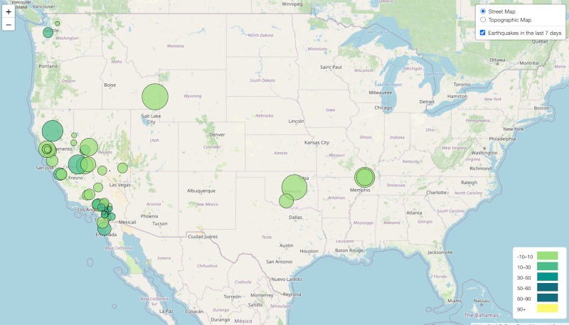

# leaflet-challenge

This project uses JSON data on earthquakes over the past day from USGS (https://earthquake.usgs.gov/earthquakes/feed/v1.0/geojson.php).

## Code Notes
* The JS code for the map is located inside leaflet-part-1/static/js

* Help on the legend was acquired from (https://gis.stackexchange.com/questions/193161/add-legend-to-leaflet-map)

_Leaflet Map of USGS Earthquake Data_